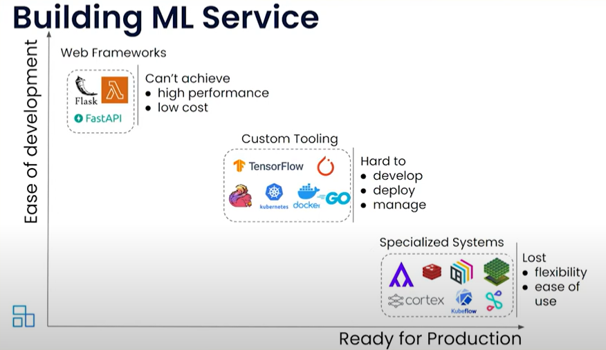
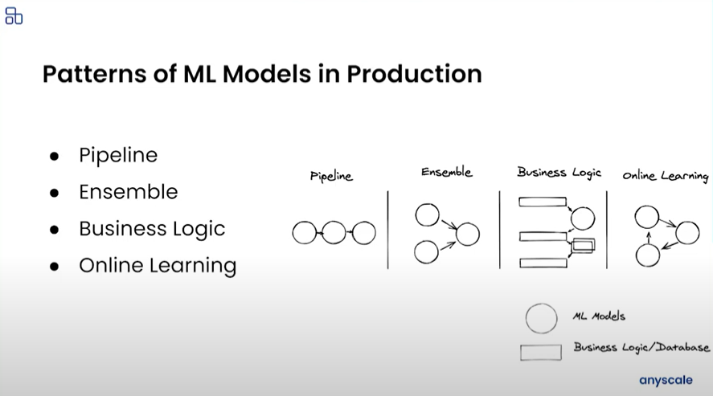
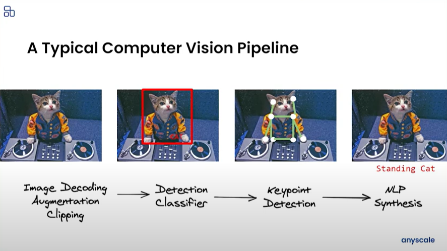
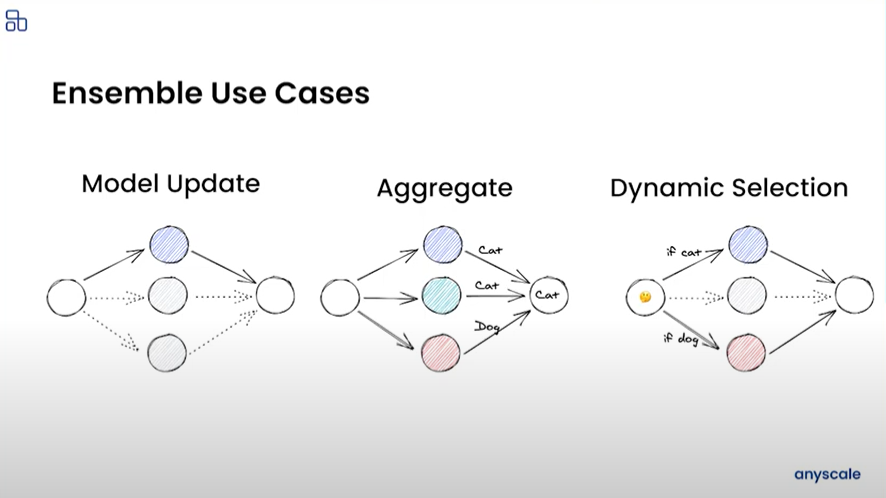
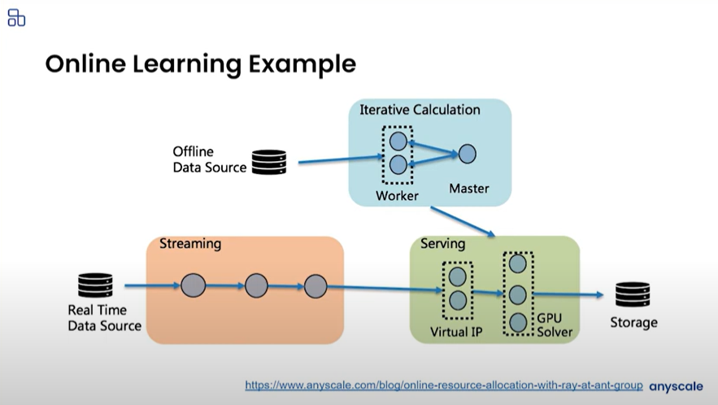

# Patterns for model serving

date: 2023/11/03

Fecha de desarrollo: [[2021]]

## Introducción

Para montar un mondelo en un ecosistema es posible utilizar diferentes herramientas. Por lo que es necesario saber en qué momentos utilizar cada una. Ponemos algunos ejemplos para iniciar.

Esto también nos lleva a identificar el patrón de construcción que tomaremos para que nuestros modelos se entrenen. Anyscale propone los siguientes:

## Pipelines

## Ensambles

## Online learning

## Refs

[Ray Serve Patterns](https://www.youtube.com/watch?v=mM4hJLelzSw)