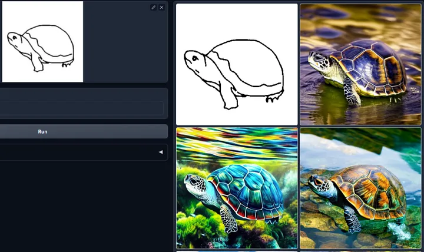
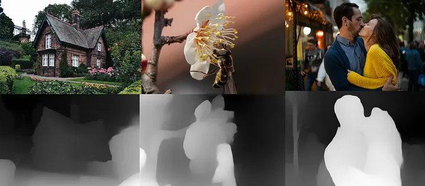
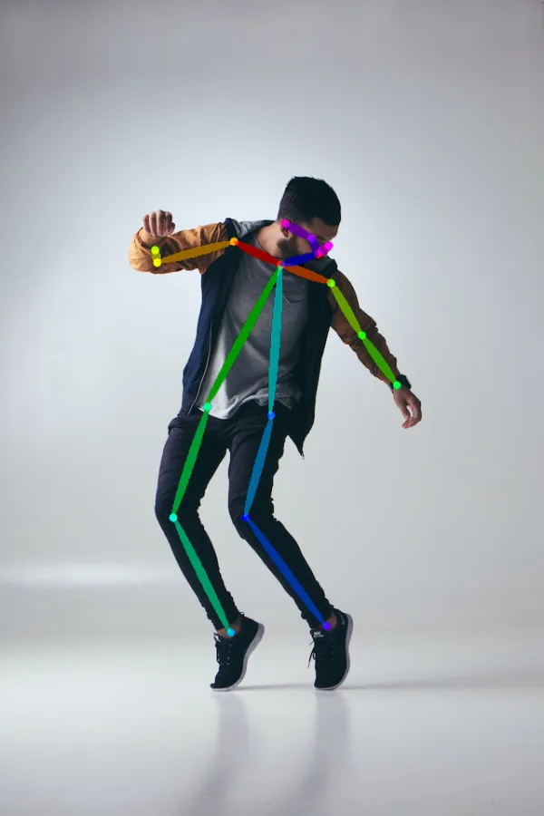

# [[ControlNet]]

date: 2023/11/03

Fecha de desarrollo: [[2023]]

## Resumen

ControlNet es una estructura de red neural diseñada para controlar modelos de difusión mediante la incorporación de condiciones adicionales.

Lo revolucionario de ControlNet radica en su solución al problema de la consistencia espacial. Mientras que previamente no existía una forma eficiente de indicar a un modelo de IA qué partes de una imagen de entrada conservar, ControlNet cambia esto al introducir un método que permite a los modelos de Stable Diffusion utilizar condiciones de entrada adicionales que le indican al modelo exactamente qué hacer.
ControlNet puede tomar el modelo de difusión existente o la difusión y simplemente realizar cambios en la arquitectura y agregar lo que desee, como se muestra en la imagen de abajo.
ControlNet puede tomar imágenes simples e imágenes garabateadas y convertirlas para crear múltiples imágenes.

¿cómo funciona?
ControlNet crea una copia de una red neuronal y mantiene una red neuronal mientras realiza cambios en otra red neuronal para producir el resultado final.
Una de sus propiedades notables se ejemplifica cuando se carga una imagen de un hombre de pie, manteniendo la pose y luego se usa ControlNet para generar nuevas imágenes reemplazando al hombre con un niño, una mujer o cualquier otra cosa.
Copia los pesos de los bloques de la red neuronal en una copia "bloqueada" y una copia "entrenable".
El "entrenable" aprende su condición. El “bloqueado” preserva su modelo.
Gracias a esto, los modelos de difusión listos para producción estarán protegidos mediante entrenamiento con un pequeño conjunto de datos de pares de imágenes.

¿Qué hace?
Ya hay más de 50 modelos ControlNet públicos y abiertos disponibles en el hub de Hugging Face, y podemos clasificarlos en

[[Modelo de borde]] Un detector de bordes astuto es un detector de bordes de uso general y de la vieja escuela. Extrae los contornos de una imagen. Es útil para conservar la composición de la imagen original.

[[Garabatos]]
ControlNet también puede convertir garabatos en una imagen

[[Mapa de profundidad]]
Al igual que la profundidad a la imagen en Stable Difusion v2, ControlNet puede inferir un mapa de profundidad a partir de la imagen de entrada. El mapa de profundidad de ControlNet tiene una resolución más alta que el de Stable Diffusion v2.

[[Mapa de segmentación]]
Genere imágenes basadas en un mapa de segmentación extraído de la imagen de entrada.

[[Detección de pose humana]]
Openpose es un modelo de detección rápida de puntos clave [[HPE]] que puede extraer poses humanas como posiciones de manos, piernas y cabeza. Vea el ejemplo a continuación.

[[detector de bordes HED]]
HED (Detección de bordes anidada holísticamente) es un detector de bordes bueno para producir contornos como lo haría una persona real. Según los autores de ControlNet, HED es adecuado para cambiar el color y cambiar el estilo de una imagen.

## Refs

[Adding Conditional Control to Text-to-Image Diffusion Models](https://arxiv.org/pdf/2302.05543.pdf)

