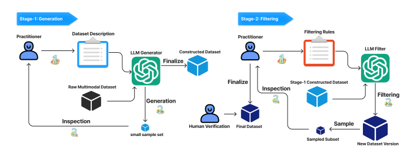

# Medición y mejora de rendimiento en razonamiento de cadena en modelos de lenguaje y visión

date: 2023/11/07

Fecha de desarrollo: 2023/10

# Medición y Mejora del Razonamiento en Cadena en Modelos de Lenguaje y Visión

# Medición y Mejora del Razonamiento en Cadena en Modelos de Lenguaje y Visión

## Tabla de Contenidos
- [Medición y mejora de rendimiento en razonamiento de cadena en modelos de lenguaje y visión](#medición-y-mejora-de-rendimiento-en-razonamiento-de-cadena-en-modelos-de-lenguaje-y-visión)
- [Medición y Mejora del Razonamiento en Cadena en Modelos de Lenguaje y Visión](#medición-y-mejora-del-razonamiento-en-cadena-en-modelos-de-lenguaje-y-visión)
- [Medición y Mejora del Razonamiento en Cadena en Modelos de Lenguaje y Visión](#medición-y-mejora-del-razonamiento-en-cadena-en-modelos-de-lenguaje-y-visión-1)
  - [Tabla de Contenidos](#tabla-de-contenidos)
  - [Resumen](#resumen)
  - [Introducción](#introducción)
  - [Trabajos Relacionados](#trabajos-relacionados)
  - [Benchmark CURE](#benchmark-cure)
  - [Pipeline de Generación de Datos con LLM y Humanos en el Bucle](#pipeline-de-generación-de-datos-con-llm-y-humanos-en-el-bucle)
  - [\[\[Métricas\]\] de Evaluación](#métricas-de-evaluación)
    - [Performance de \[\[razonamiento\]\]](#performance-de-razonamiento)
    - [Metricas de \[\[consistencia\]\] del razonamiento](#metricas-de-consistencia-del-razonamiento)
  - [Estadísticas del Conjunto de Datos](#estadísticas-del-conjunto-de-datos)
  - [Enfoque](#enfoque)
  - [Refs](#refs)

## Resumen
Los modelos de lenguaje y visión (VLMs) funcionan como asistentes visuales interpretando consultas naturales para generar salidas similares a las humanas. Este trabajo explora sus habilidades de razonamiento humano y propone una medida de consistencia basada en el razonamiento en cadena (CoT) para evaluar estas capacidades. A través de un pipeline LLM-Humanos en el Bucle, construimos el benchmark CURE para evaluar el rendimiento de razonamiento en frío y la consistencia de los VLMs. Nuestros hallazgos sugieren que los VLMs actuales, incluyendo BLIP-2, carecen de un razonamiento visual robusto y consistencia. Proponemos y validamos un marco de entrenamiento de dos etapas para mejorar el rendimiento de los VLMs en estas áreas.

## Introducción
El desarrollo de VLMs se ha centrado en generar respuestas aprovechando datos multimodales y LLMs. Escudriñamos la capacidad de razonamiento de estos modelos, con el objetivo de medir y mejorar su rendimiento y la consistencia de sus cadenas de razonamiento.

## Trabajos Relacionados
El preentrenamiento de VLMs ha sido crucial para su éxito en varias aplicaciones. Inicialmente dependientes de detectores de objetos, los esfuerzos recientes apuntan a agilizar los procesos de inferencia e integrar datos visuales extensos. La consistencia del razonamiento CoT es otra faceta que se ha explorado para mejorar el rendimiento del razonamiento de los LLMs, pero la consistencia del razonamiento de los LLMs aún está por determinarse.

## Benchmark CURE
El benchmark CURE está diseñado para evaluar el rendimiento del razonamiento visual y la consistencia en los VLMs. Se basa en el conjunto de datos [[Sherlock]](https://github.com/allenai/sherlock), añadiendo anotaciones para cadenas de razonamiento [[CoT]] y respuestas candidatas, transformando la evaluación en una tarea de respuesta a preguntas de opción múltiple.

## Pipeline de Generación de Datos con LLM y Humanos en el Bucle
Se utiliza un pipeline de dos etapas para la construcción del conjunto de datos, donde los LLMs generan un conjunto de datos preliminar y los humanos ayudan a refinar y filtrar el conjunto para asegurar un resultado de alta calidad.



## [[Métricas]] de Evaluación
[[CURE]] emplea métricas de opción múltiple para evaluar la habilidad de razonamiento y la consistencia de los VLMs. Cada imagen se asocia con preguntas de alto nivel y seis inferencias candidatas, junto con cadenas de razonamiento compuestas de subpreguntas, cada una con seis respuestas candidatas. Se llama Cure por Chain-of-Thought VisUAl Reasoning Evaluation

### Performance de [[razonamiento]]

[[Rendimiento en el Razonamiento de Alto Nivel (Rh)]]: Esta métrica evalúa la capacidad de los VLMs para elegir la inferencia más probable de un conjunto de opciones proporcionadas para cada imagen. Es como un examen de opción múltiple donde el modelo tiene que escoger la mejor respuesta, y esta métrica cuenta cuántas veces el modelo elige la respuesta correcta.

\[ R_h = \frac{1}{N} \sum_{i=1}^{N} I(\hat{a}_{ih} = a_{ih}) \]


[[Rendimiento en el Razonamiento en Cadena de Pensamiento (Rcot)]]: Esta métrica mide la habilidad de los VLMs para responder correctamente todas las subpreguntas que forman la cadena de razonamiento de una imagen. Piensa en esto como una serie de preguntas de seguimiento que llevan a una conclusión; si el modelo puede responder correctamente cada paso del camino, obtiene un buen puntaje en esta métrica.

\[ R_{cot} = \frac{1}{N} \sum_{i=1}^{N} \left( I\left( \sum_{j=1}^{M} I(\hat{a}_{ij} = a_{ij}) = M \right) \right) \]


[[Rendimiento General en el Razonamiento (Ro)]]: Esta métrica combina las dos anteriores. Evalúa si los VLMs pueden realizar con éxito tanto el razonamiento de alto nivel como el razonamiento en cadena para cada imagen. Es una forma de asegurarse de que los modelos no solo son buenos en una sola tarea sino consistentes en su capacidad de razonamiento a través de tareas múltiples y más complejas.
\[ R_{o} = \frac{1}{N} \sum_{i=1}^{N} \left( I(\hat{a}_{ih} = a_{ih}) \cdot I\left( \sum_{j=1}^{M} I(\hat{a}_{ij} = a_{ij}) = M \right) \right) \]


```python
# Primero, definimos una función indicadora.
def indicator(condition):
    return 1 if condition else 0

# Supongamos que tenemos listas de respuestas correctas y predicciones para el razonamiento de alto nivel y para las subpreguntas.
# Por ejemplo, para 5 imágenes con una sola subpregunta por imagen:

# Respuestas correctas para el razonamiento de alto nivel (high-level reasoning).
correct_high_level = [1, 2, 3, 4, 5]

# Predicciones del modelo para el razonamiento de alto nivel.
predicted_high_level = [1, 2, 3, 3, 5]

# Respuestas correctas para las subpreguntas (chain-of-thought reasoning).
correct_subquestions = [[1], [2], [3], [4], [5]]

# Predicciones del modelo para las subpreguntas.
predicted_subquestions = [[1], [2], [3], [3], [5]]

# Calculamos Rh, Rcot y Ro usando las funciones indicadoras.
Rh = sum(indicator(p, c) for p, c in zip(predicted_high_level, correct_high_level)) / len(correct_high_level)

Rcot_list = []
for correct_chain, predicted_chain in zip(correct_subquestions, predicted_subquestions):
    # Aquí asumimos que todas las subpreguntas deben ser contestadas correctamente para que la cadena de razonamiento sea correcta.
    Rcot_list.append(indicator(sum(indicator(p, c) for p, c in zip(predicted_chain, correct_chain)), len(correct_chain)))

Rcot = sum(Rcot_list) / len(correct_subquestions)

# Ro se calcula tomando el producto de los indicadores para Rh y Rcot para cada imagen y sumando estos productos.
Ro = sum(indicator(p_high, c_high) * Rcot_i for p_high, c_high, Rcot_i in zip(predicted_high_level, correct_high_level, Rcot_list)) / len(correct_high_level)

# Mostramos las métricas
print(f"Rh: {Rh}, Rcot: {Rcot}, Ro: {Ro}")

```

### Metricas de [[consistencia]] del razonamiento

1. **[[Consistencia en el Razonamiento hacia Adelante (Cf)]]**: Esta métrica mide la capacidad de los VLMs para responder correctamente la pregunta de inferencia de alto nivel después de haber respondido correctamente todas las subpreguntas de la cadena de razonamiento. En otras palabras, verifica si el modelo puede llegar a la conclusión correcta después de haber procesado todos los pasos intermedios correctamente. 

\[Cf = \frac{1}{N} \sum_{i=1}^{N} s_i \cdot I(\hat{a}_{ih} = a_{ih})\]

Donde \( s_i \) es 1 si todas las subpreguntas para la i-ésima imagen han sido respondidas correctamente y 0 en caso contrario. \( \hat{a}_{ih} \) es la respuesta elegida por el modelo y \( a_{ih} \) es la respuesta correcta.

2. **[[Consistencia en el Razonamiento hacia Atrás (Cb)]]**: Esta métrica evalúa la habilidad de los VLMs para responder todas las subpreguntas correctamente, dado que la pregunta de inferencia de alto nivel se ha respondido correctamente. Esencialmente, esto significa que si el modelo llega a la conclusión correcta, también debería haber seguido un camino de razonamiento correcto para llegar allí.
   

\[Cb = \frac{1}{N} \sum_{i=1}^{N} h_i \cdot \left( I\left( \sum_{j=1}^{M} I(\hat{a}_{ij} = a_{ij}) = M \right) \right)\]

Donde \( h_i \) es 1 si la pregunta de inferencia de alto nivel para la i-ésima imagen ha sido respondida correctamente y 0 en caso contrario. \( M \) es la cantidad de subpreguntas por imagen.

Estas métricas ayudan a entender no solo si los VLMs están llegando a las conclusiones correctas, sino también si están siguiendo un proceso de razonamiento lógico y coherente para llegar a esas conclusiones.

## Estadísticas del Conjunto de Datos
El conjunto de datos CURE comprende 1622 instancias con un promedio de 2.91 cadenas de razonamiento por instancia. El conjunto se centra en conceptos orientados al ser humano, y las preguntas de tipo "Qué" predominan debido a su uso extensivo en el conjunto de datos Sherlock para facilitar la inferencia visual.

## Enfoque
Proponemos un marco de entrenamiento para mejorar la generación de racionales de los VLMs, mejorando así el rendimiento


## Refs

https://arxiv.org/abs/2309.04461


