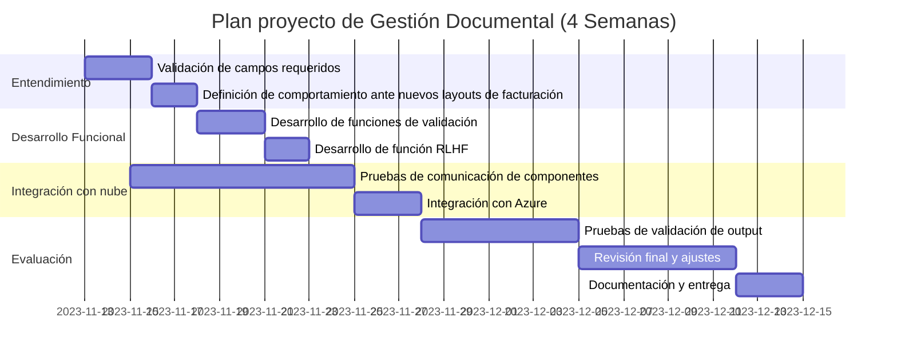

```mermaid
gantt
    title Plan proyecto de Gestión Documental (4 Semanas)
    dateFormat  YYYY-MM-DD
    section Entendimiento 
    Validación de campos requeridos                                  :         des1, 2023-11-13, 3d
    Definición de comportamiento ante nuevos layouts de facturación   :        des2, after des1, 2d
    section Desarrollo Funcional
    Desarrollo de funciones de validación                             :         des3, after des2, 3d
    Desarrollo de función RLHF                                        :         des4, after des3, 2d
    section Integración con nube
    Pruebas de comunicación de componentes                            :         des5, 2023-11-15, 10d
    Integración con Azure                                             :         des6, after des5, 3d
    section Evaluación
    Pruebas de validación de output                                   :         des7, after des6, 7d
    Revisión final y ajustes                                          :         des8, after des7, 7d
    Documentación y entrega                                          :         des9, after des8, 3d
```
