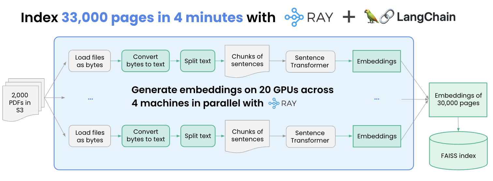

# parallel embedding

date: 2023/11/03

Fecha de desarrollo: 2023

tags: #Embeddings #RAG 

## Introducción

Dado que los modelos de embedding son de reciente creación, tienen aún limitantes de procesamiento, y almacenamiento. Al corte de :date los modelos de embedding permiten almacenar hasta 8k tokens por embedding lo que hace que ingestar grandes cantidades de documentos sea largo y costoso en caso de usar opciones como adda de openai. Recientemente se han desarrollado alternativas para paralelizar los trabajos de embedding como [[RAY]] que tienen integraciones con langchain para facilitar su implementación.

## Refs

[RAY](https://github.com/ray-project/langchain-ray/tree/main/embedding_pdf_documents)

[Turbocharge LangChain: guide to 20x faster embedding](https://www.anyscale.com/blog/turbocharge-langchain-now-guide-to-20x-faster-embedding)
