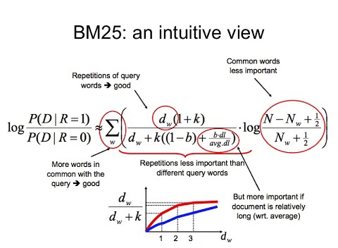

# Retrievers

[[BM25]](https://python.langchain.com/docs/integrations/retrievers/bm25)

El modelo de relevancia BM25 es una evolución de los modelos probabilísticos de recuperación de información. BM25 es ampliamente utilizado en sistemas de búsqueda para calcular la relevancia de un documento con respecto a una consulta.

El objetivo principal de BM25 es calcular la probabilidad de que un documento \( d \) sea relevante para una consulta dada.

1. **Repetición de palabras de consulta en el documento**: Si un documento tiene muchas repeticiones de las palabras clave de la consulta, es probable que sea relevante. Esta idea está representada en la fórmula por el término \( \frac{d_{w} + k}{d_{w}} \), donde \( d_{w} \) es el número de veces que la palabra \( w \) aparece en el documento.

2. **Longitud del documento**: Los documentos más largos tienden a tener más palabras en general, por lo que es más probable que contengan repeticiones de palabras clave simplemente debido a su longitud. Para corregir esto, BM25 introduce un factor de normalización \( \left(1-b + b\frac{dl}{avg.dl} \right) \) donde \( dl \) es la longitud del documento, \( avg.dl \) es la longitud media de los documentos en la colección y \( b \) es un parámetro que determina cuánta importancia dar a la normalización.

3. **Palabras comunes**: No todas las palabras de una consulta son igualmente importantes. Las palabras que son comunes en todos los documentos (como "y", "de", "la") son menos informativas que las palabras raras. El término \( log \) captura esta idea, penalizando las palabras que aparecen en muchos documentos (\( N_{w} \) es el número de documentos que contienen la palabra \( w \) y \( N \) es el número total de documentos).

Así, de manera general, la fórmula BM25 combina la frecuencia de las palabras clave en un documento, la longitud del documento y la rareza de las palabras clave para determinar la relevancia de un documento a una consulta.