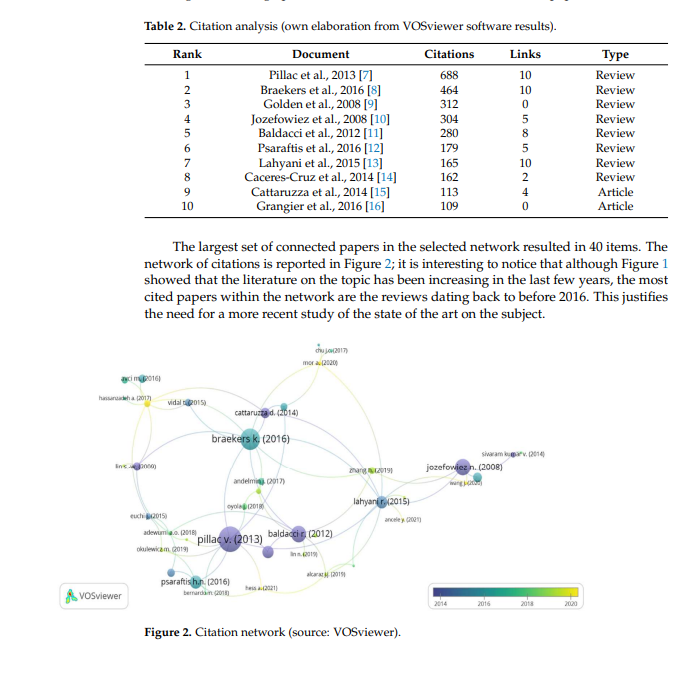

# Optimization and Machine Learning Applied to Last-Mile Logistics: A Review [[2022/04]]

## Autores y Afiliación

Nadia Giuffrida, [[School of Architecture]], [[Planning and Environmental Policy]], University College Dublin, Dublin, Ireland

Jenny Fajardo-Calderin, DeustoTech, Faculty of Engineering, [[University of Deusto]], Bilbao, [[Spain]]  

Antonio D. Masegosa, DeustoTech, Faculty of Engineering, [[University of Deusto]], Bilbao, [[Spain]]

Frank Werner, Software AG, Saarbrücken, [[Germany]]

Margarete Steudter, Software AG, Saarbrücken, [[Germany]]

Francesco Pilla, School of Architecture, Planning and Environmental Policy, University College Dublin, Dublin, Ireland

## Resumen

El crecimiento del comercio electrónico está cambiando la visión de las empresas sobre la logística de última milla, debido a su creciente impacto en toda la cadena de suministro. Las nuevas tecnologías están aumentando las expectativas de los usuarios con la necesidad de desarrollar experiencias de entrega personalizadas. Además, la creciente presión en las cadenas de suministro también ha creado desafíos adicionales para los proveedores. Al mismo tiempo, este fenómeno genera un aumento del impacto en la habitabilidad de nuestras ciudades, debido a la congestión del tráfico, la ocupación de espacios públicos y la contaminación ambiental y acústica vinculada a la logística urbana. En este contexto, la optimización de las entregas de última milla es un imperativo no sólo para las empresas con paquetes que necesitan ser entregados en las áreas urbanas, sino también para las administraciones públicas que quieren garantizar una buena calidad de vida para los ciudadanos. En los últimos años, muchos académicos se han centrado en el estudio de técnicas de optimización logística y, en particular, de la última milla. Además de las técnicas de optimización tradicionales, vinculadas a las disciplinas de investigación operativa, los recientes avances en el uso de sensores e IoT, y la consecuente gran cantidad de datos que se derivan de ello, están impulsando hacia un mayor uso de técnicas de big data y análisis, como el aprendizaje automático y la inteligencia artificial, que también están presentes en este sector. Sobre esta premisa, el objetivo de este trabajo es proporcionar una visión general de los avances más recientes en la literatura relacionados con las técnicas de optimización de entregas de última milla. Esto se utilizará como línea de base para los académicos que pretenden explorar nuevos enfoques y técnicas en el estudio de la optimización de la logística de última milla. #citylogistics #vehicle_routing_problem #machine_learning 

https://doi.org/10.3390/su14095329

[original](https://www.mdpi.com/2071-1050/14/9/5329)

## Área de conocimiento (ACM)

Logística, Investigación de operaciones, Aprendizaje automático

## Códigos de repositorio 

No se proporcionaron

## Hipótesis principales

- El crecimiento del comercio electrónico está cambiando la logística de última milla
- La optimización de la logística de última milla es crítica para empresas y gobiernos 
- Se están aplicando técnicas de optimización tradicionales y de aprendizaje automático

## Diseño experimental

Revisión bibliométrica y crítica de la literatura reciente sobre optimización de logística de última milla

## Detalles de la muestra/participantes

77 artículos sobre optimización de logística de última milla indexados en Scopus

## Instrumentos o materiales utilizados

Análisis bibliométrico con VOSviewer, revisión crítica de artículos

## Principales hallazgos/resultados

- Predominio de modelos tradicionales de optimización vehicular (56 artículos) sobre modelos de aprendizaje automático (19 artículos)
- Los modelos de aprendizaje automático se aplican principalmente a pronóstico de demanda y detección de anomalías
- Los modelos tradicionales abordan variantes del problema de ruteo vehicular considerando restricciones realistas
- Pocos estudios (3 artículos) proponen enfoques híbridos combinando optimización y aprendizaje automático

## Limitaciones del estudio 

- No incluye literatura más reciente publicada después de junio 2021
- Se limita a artículos indizados en Scopus

## Recomendaciones para trabajos futuros

- Desarrollar y probar técnicas de aprendizaje no supervisado para logística de última milla
- Aplicar enfoques híbridos que combinen optimización y aprendizaje automático
- Validar experimentalmente nuevos modelos en casos reales de logística urbana